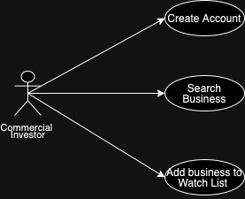

# Front Matter
## Front Page

## Introduction
  One thing to know about me is that I have many interests and hobbies that I like to keep up with when time allows me to. Of those many interests, two of them fit together very well. Those being **personal finance** and **commercial investing**. In the last decade more and more average people have been looking for ways to use their money to make money, the most common avenue usually being through investing in the stock market. That said, unless they go to school for it or do _copious_ amounts of research, the everyday citizen isn't going to have the ability to denote optimal investments from unadvisable ones. Due to my interest in the subject, I am privy to certain agreed upon practices that, multiple experts agree, aid in investing in quality companies that are likely to grow. 
  
  Working inside the problem domain of **Company Analysis for the Means of Commercial Investing**, I would like to develop a software that could gather financial data on publicly traded companies on the American Stock Exchange and then use that data to give investing recommendations based on a preprogrammed set of logic. The software would ideally be able to scrape data from a particular website that publicly posts this kind of information upon request, then input it into a database, assigning it as an attribute of whatever company is being searched for. Once the data is retrieved and organized it can then be used to run the calculations that would denote whether or not it would be ideal to invest in said company before displaying it to the user. An example of this would be calculating the company's price to earnings ratio to show users whether or not the company is likely over valued or not. 

  While there are similar tools like this readily available on the internet, this program would be more focused on providing **as much simplicity as possible for the average commercial investor** by displaying the information in a **blunt straight forward manner through a non-complicated, easy to understand, operating system**. 

  This README will begin to develop this projects scope by detailing the programs intended features as they relate to their corresponding user stories. This page will also illustrate how the application is intended to interact with both users and the websites being scraped to act as its source of data. 
## Table of Contents
### [Requirements Statements](#requirements-statements)
* #### [User Stories](#user-stories)
* #### [Use Cases](#use-cases)
* #### [Features](#features)
* #### [Gherkin Validation](#gherkin-validation)
### [Specifications](#specifications)
* #### [Concept](#concept)
* #### [UX Notes](#ux-notes)
* #### [Interfaces](#interfaces)
* #### [Behaviors](#behaviors)
### [Features & Packages](#features&packages)

# Requirements Statements 
### User Stories 
#### User Story 1:
    As a commercial investor and user of the application I want to be able to search up a business by its stock ticker and recieve results
#### User Story 2:
    As a commercial investor I want easy to understand indicators of whether or not I should buy a stock.
#### User Story 3:
    As a developer I want to be able to scrape company financial data from a website 
#### User Story 4:
    As a developer I want to be able to assign and organize scraped data into classes 
#### User Story 5:
    As a user I want a simple interface
#### User Story 6:
    As a user I would like to be able to add particular companies i'm interested in to a watch list to revisit later

### Use Cases 

### Features 
* Register for an Account
* Login to Account
* Search buisiness using stock ticker
* Scrape website for finacial data on business in question
* Organize scraped data in classes 
* Recently organized class data will be displayed on interface in a simplfied manner
* Application will run finacial data through preprogrammed algorithms and display the results on the interface
* Based on results of calculations, application will provide a recommendation for investing strategy and display it on interface
* Users with accounts have the ability to add searched business into a watch list allowing them to come back and view it later 

### Gherkin Validation 
**Feature**: Register

  **Scenario Outline**:

    **Given**:

    **When**:

    **Then**:

  **Outcome**:

# Specifications 
### Concept 
### UX Notes 
### Interfaces (Controls) 
### Behaviors 

# Features & Packages 
### Feature/Package A (appropriate UML diagrams)
### Feature/Package N (appropriate UML diagrams)
